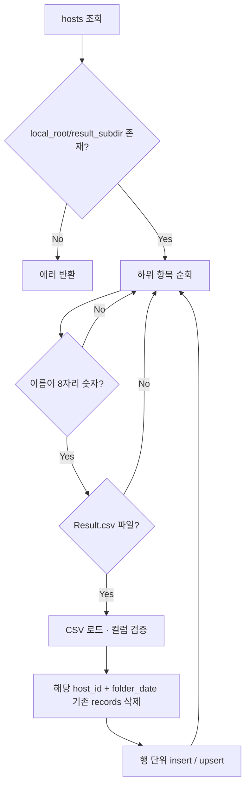

# RouterCut 로그 수집·뷰어 — 설계 문서

## 1. 목적

SMD/라우터 커팅 검사 설비에서 생성되는 일별 `Result.csv`와 검사 이미지를 **네트워크 공유(로컬 마운트 경로)**에서 읽어 SQLite에 적재하고, 웹 UI에서 **일자·장비(IP)별 조회·검색·NG 필터·이미지 표시·엑셀 내보내기**를 제공한다.

앱 자체는 SMB/CIFS 마운트를 자동 수행하지 않는다. 운영 서버에서 공유를 마운트한 뒤, **마운트 루트(`local_root`)**만 등록한다.

---

## 2. 용어 및 데이터 소스 구조

### 2.1 디렉터리 규칙

| 경로 요소 | 설명 |
|-----------|------|
| `local_root` | OS에 마운트된 경로(예: `/mnt/10.56.164.91`). 장비(`hosts`)마다 다를 수 있다. |
| `result_subdir` | 기본값 `Result2`. 실제 데이터 루트는 `{local_root}/{result_subdir}`. |
| `yyyyMMdd` | 8자리 숫자 폴더명만 스캔 대상(예: `20260305`). |
| `Result.csv` | 해당 일자 폴더 **안에 파일이 있을 때만** 해당 일자 처리. 없으면 건너뜀. |
| `Image/` | `Result.csv`와 동일 레벨. 검사 이미지 파일 위치. |

즉, 기대 구조는 다음과 같다.

```text
{local_root}/Result2/
  20260101/
    (Result.csv 없음 → 무시)
  20260305/
    Result.csv
    Image/
      111.png
      ...
```

### 2.2 `hosts`와 IP

- DB의 `ip`는 **식별·표시용**이다. 실제 파일 접근은 **반드시 `local_root`**로 한다.
- 기본 장비 IP `10.56.164.91`은 최초 DB 초기화 시 한 번 자동 등록될 수 있다(구현: `app._ensure_default_host`).

---

## 3. CSV 스펙 (`Result.csv`)

### 3.1 필수 컬럼

헤더명은 대소문자 무시 후 대문자로 정규화한다. 다음 집합이 모두 있어야 해당 CSV를 파싱한다.

| 컬럼 | 설명 | 앱 내 처리 요약 |
|------|------|------------------|
| `MODEL` | 모델명(문자) | 최대 50자로 잘림 |
| `TIME` | 검사 시각 | 문자열로 보존(형식: `yyyy-MM-dd HH:mm` 가정) |
| `BARCODE` | PCB 바코드(숫자 위주) | 비숫자 제거 후 최대 20자 |
| `CAM` | 카메라 번호 | 정수 |
| `ROI` | 검사 영역 번호 | 정수(1~8 등 가변) |
| `RESULT` | 양불 | `OK` / `NG`. 그 외는 휴리스틱으로 정규화 |
| `VALUE` | 측정값 | 문자열로 보존(부호 포함) |
| `SPEC` | 허용 기준(예: ±0.5) | 문자열로 보존 |
| `PATH` | 검사 이미지 **PC 절대 경로** | 이미지 파일명·매핑에 사용(§4) |

### 3.2 인코딩

- 우선 `utf-8-sig`, 실패 시 `cp949`로 재시도.

### 3.3 파싱 실패·스킵

- 필수 컬럼 부족: 해당 일자 CSV 전체 스킵.
- 행 단위 변환 오류: 해당 행만 스킵.

---

## 4. 이미지 경로 매핑 (`PATH` → 로컬 파일)

검사 PC 기준 `PATH`와 마운트 구조가 다르므로, **일자 폴더(`folder_date`)와 동일 레벨의 `Image/`**에 있는 파일명으로 연결한다.

### 4.1 파일명 추출 우선순위

1. 정규식 `\Image\파일명` 또는 `/Image/파일명` 형태(경로 끝).
2. 문자열에 `Result` 다음에 8자리 날짜와 나머지 경로가 이어지는 패턴이 있고, 그 날짜가 **현재 스캔 중인 `folder_date`와 일치**하면, 그 이하에서 `Image` 폴더 아래 파일명을 추출한다(구현: 정규식 `RE_AFTER_RESULT`).
3. 그 외: `basename(PATH)` 사용.

경로에 사용된 원화 기호 등(예: `￦`)·전각 백슬래시는 `\`로 치환한다.

### 4.2 DB 저장

- `records.image_file`에는 **파일명(basename)** 위주로 저장한다(스캔 시 실제존재 여부와 무관하게 파싱된 이름은 유지 가능).
- 웹에서 이미지 요청 시 실제 파일은 아래로 해석한다.

```text
resolve(local_root, result_subdir, folder_date, "Image", image_file_basename)
```

### 4.3 (TIME, BARCODE, CAM)당 이미지 1장 가정

- CSV에 ROI가 여러 행이어도 동일 검사 단위에서 `PATH`가 같은 이미지를 가리키는 전제.
- 피벗 그룹 합칠 때 `image_file`은 비어 있지 않은 값으로 갱신.

---

## 5. 데이터베이스 설계 (SQLite)

파일 기본 위치: `data/routercut.db` (`database.DEFAULT_DB`).

### 5.1 `hosts`

| 컬럼 | 타입 | 설명 |
|------|------|------|
| `id` | INTEGER PK | |
| `ip` | TEXT UNIQUE | 장비 IP(·식별자) |
| `name` | TEXT | 표시 이름 |
| `local_root` | TEXT | 마운트 절대 경로 |
| `result_subdir` | TEXT | 기본 `Result2` |
| `created_at` | TEXT | 생성 시각 |

### 5.2 `records`

장당 CSV **한 행 = ROI 하나**를 저장(롱 포맷).

| 컬럼 | 타입 | 설명 |
|------|------|------|
| `id` | INTEGER PK | |
| `host_id` | FK → hosts | |
| `folder_date` | TEXT | `yyyyMMdd` |
| `model` | TEXT | |
| `time` | TEXT | |
| `barcode` | TEXT | |
| `cam` | INTEGER | |
| `roi` | INTEGER | |
| `result` | TEXT | `OK`/`NG` |
| `value` | TEXT | |
| `spec` | TEXT | |
| `image_file` | TEXT | basename |
| `source_csv` | TEXT | 수집 원본 경로(디버그) |

**무결성:** `UNIQUE(host_id, folder_date, time, barcode, cam, roi)` — 재스캔 시 동일 키는 업서트.

**인덱스:** `(host_id, folder_date)`, `(host_id, time, barcode)` 등.

`ON DELETE CASCADE`로 호스트 삭제 시 기록 삭제.

---

## 6. 스캔(수집) 프로세스

구현: `scanner.scan_host(conn, host_id)`.



- **일자 단위 전체 삭제 후 재삽입**이므로, 스캔은 “그 날짜 폴더의 CSV 스냅샷”을 DB에 맞춘다.
- 성공 시 `folders`에 처리한 `yyyyMMdd` 목록, `rows`에 삽입·갱신한 행 수(배치 크기)를 반환.

---

## 7. 피벗(웹·엑셀용 와이드 포맷)

구현: `pivot.build_pivot_rows`, `pivot.filter_ng_only`.

### 7.1 그룹 키

`(TIME, BARCODE, CAM, MODEL)`이 동일한 레코드를 한 행으로 합친다.

### 7.2 컬럼 구성

1. 고정: `host_id`, `host_ip`, `folder_date`, `model`, `time`, `barcode`, `cam`, `spec`
2. 데이터에 등장한 모든 `ROI` 값을 **오름차순**으로 정렬 후, ROI마다 `ROI{n}_VALUE`, `ROI{n}_RESULT`
3. `image_file`, `has_ng`(임의 ROI에서 `NG` 여부)

### 7.3 NG만 보기

- `has_ng == True`인 피벗 행만 필터.

### 7.4 정렬

- 원시 조회: `folder_date`, `time`, `barcode`, `cam`, `roi` 오름차순.
- 피벗 행 순서: 그룹 키 `(time, barcode, cam)` 정렬.

---

## 8. HTTP API

| 메서드 | 경로 | 설명 |
|--------|------|------|
| GET | `/` | 웹 UI (`templates/index.html`) |
| GET | `/api/hosts` | 호스트 목록 |
| POST | `/api/hosts` | JSON: `ip`, `local_root`, `name?`, `result_subdir?` |
| PATCH | `/api/hosts/<id>` | `ip`, `name`, `local_root`, `result_subdir` 중 일부 |
| DELETE | `/api/hosts/<id>` | 호스트 및 기록 삭제 |
| POST | `/api/hosts/<id>/scan` | 단일 장비 스캔 |
| POST | `/api/scan_all` | 등록된 모든 장비 스캔 |
| GET | `/api/dates?host_id=` | DB에 존재하는 `folder_date` 목록(내림차순) |
| GET | `/api/records` | 쿼리: `host_id`, `date`, `q`, `ng_only`, `pivot`(기본 1) |
| GET | `/api/image` | `host_id`, `folder_date`, `file`(basename) |
| GET | `/api/export.xlsx` | 현재 필터와 동일 조건, 피벗 시트 |

### 8.1 `/api/records` 검색 `q`

- `barcode`, `model`, `time`에 대해 `LIKE %q%`(부분 일치).

### 8.2 이미지 API 보안

- 요청 파일명은 **basename만** 허용.
- 실제 경로는 `{local_root}/{result_subdir}` 아래로 **상대 경로 검증**(`is_relative_to` 또는 `commonpath`) 후 존재할 때만 전송.

---

## 9. 웹 UI

- 정적 자원: `static/style.css` — 다크 테마.
- 기능: 장비 선택, 일자 선택, 검색, NG만, 이미지 표시 토글, 단일/전체 스캔, 엑셀 링크, 호스트 추가·`local_root` 수정.

---

## 10. 실행 및 환경 변수

| 변수 | 기본 | 설명 |
|------|------|------|
| `ROUTERCUT_DEFAULT_LOCAL_ROOT` | `/mnt/10.56.164.91` | 기본 호스트 최초 삽입 시 `local_root` |
| `PORT` | `5000` | `python app.py` 직접 실행 시 |

의존성: `requirements.txt` (Flask, pandas, openpyxl).

---

## 11. 프로젝트 파일 구조

```text
routercut/
  app.py           Flask 라우트, 이미지 검증, 엑셀 내보내기
  database.py      SQLite 연결·스키마
  scanner.py       디렉터리 순회·CSV 적재
  pivot.py         피벗·NG 필터
  requirements.txt
  templates/
    index.html
  static/
    style.css
  data/
    routercut.db   (런타임 생성, .gitignore 대상 권장)
```

---

## 12. 알려진 제약·향후 확장 아이디어

- **마운트 자동화**: 설계 범위 밖. `mount.cifs`·`systemd`·Ansible 등으로 `local_root`를 보장.
- **증분 스캔**: 현재는 일자 단위 전체 재적재. 대용량 시 파일 mtime·해시 기반 증분 가능.
- **인증**: API/UI 무인증. 역프록시·VPN·Basic auth 등 운영 계층에서 구성 권장.
- **시간대**: `TIME`은 문자열 그대로 저장·정렬. 필요 시 DB에 정규화 타임스탬프 컬럼 추가 검토.

---

## 13. 변경 이력

| 날짜 | 내용 |
|------|------|
| 2026-04-03 | 초안 작성(코드 기준) |
